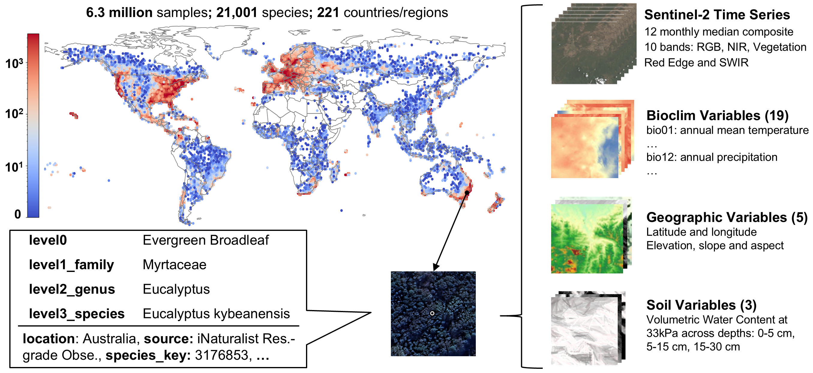

# GlobalGeoTree: A Multi-Granular Vision-Language Dataset for Global Tree Species Classification



GlobalGeoTree is a comprehensive global dataset for tree species classification, comprising 6.3 million geolocated tree occurrences spanning 275 families, 2,734 genera, and 21,001 species across hierarchical taxonomic levels. Each sample is paired with Sentinel-2 image time series and 27 auxiliary environmental variables.

## Dataset Overview

- **Total Samples**: 6.3 million geolocated tree occurrences
- **Geographic Coverage**: 221 countries/regions
- **Taxonomic Coverage**: 
  - 275 families
  - 2,734 genera
  - 21,001 species
- **Data Features**:
  - Sentinel-2 time series (12 monthly composites)
  - 27 auxiliary environmental variables
  - Hierarchical taxonomic labels

## Repository Structure

```
.
├── GlobalGeoTree/           # Dataset creation and processing
│   ├── gbif_occurrence_query.py    # GBIF data collection
│   ├── pair_data_downloader.py     # Remote sensing data download
│   ├── create_eval_set.py          # Evaluation set creation
│   └── convert_webdataset.py       # WebDataset conversion
│
└── GeoTreeCLIP/            # Model implementation
    ├── models.py           # Model architecture
    ├── train.py           # Training script
    ├── dataloader.py      # Data loading utilities
    ├── eval/              # Evaluation scripts
    ├── few-shot-finetune/ # Few-shot learning implementation
    └── tsne_vis/         # Feature visualization tools
```

## Quick Start

### Installation

```bash
# Clone the repository
git clone https://github.com/your-username/GlobalGeoTree.git
cd GlobalGeoTree

# Install dependencies
conda env create -f environment.yml
```

### Dataset Access

The dataset is available in WebDataset format on Huggingface:
- [GlobalGeoTree-6M](https://huggingface.co/datasets/yann111/GlobalGeoTree/tree/main/GlobalGeoTree-6M)
- [GlobalGeoTree-10kEval](https://huggingface.co/datasets/yann111/GlobalGeoTree/tree/main/GlobalGeoTree-10kEval)

### Model Checkpoints

The pretrained model checkpoint is available at:
- [GeoTreeCLIP-6M](https://huggingface.co/datasets/yann111/GlobalGeoTree/resolve/main/checkpoints/GGT_6M.pth)

Download the checkpoint:
```bash
# Create checkpoints directory
mkdir -p checkpoints

# Download the checkpoint
wget https://huggingface.co/datasets/yann111/GlobalGeoTree/resolve/main/checkpoints/GGT_6M.pth -O checkpoints/GGT_6M.pth
```

### Using the Model

```python
import torch
from GeoTreeCLIP.models import GeoTreeClip
from GeoTreeCLIP.dataloader import GGTDataset

# Load model and move to device
device = torch.device('cuda' if torch.cuda.is_available() else 'cpu')
model = GeoTreeClip().to(device)

# Load pretrained checkpoint
checkpoint = torch.load('./checkpoints/GGT_6M.pth', map_location=device)
model.load_state_dict(checkpoint['model_state_dict'])
model.eval()

# Prepare data
test_dataset = GGTDataset("path_to_your_data.tar", batch_size=32)
test_loader = test_dataset.get_dataloader()

# Make predictions
with torch.no_grad():
    for images, text_data, auxiliary_data, image_mask, aux_mask in test_loader:
        # Move data to device
        images = images.to(device)
        image_mask = image_mask.to(device)
        aux_mask = aux_mask.to(device)
        
        # Get predictions
        combined_features, _ = model(images, text_data, auxiliary_data, image_mask, aux_mask)
        predictions = combined_features.softmax(dim=-1)
```

## Evaluation Benchmarks

Three evaluation sets are provided:
- **GlobalGeoTree-10kEval**: 90 species (30 each from Rare, Common, and Frequent categories)
- **GlobalGeoTree-10kEval-300**: 300 species (100 each)
- **GlobalGeoTree-10kEval-900**: 900 species (300 each)

<!-- ## Citation

If you use GlobalGeoTree in your research, please cite our paper: -->

<!-- ```bibtex
@inproceedings{mu2025globalgeotree,
  title={GlobalGeoTree: A Multi-Granular Vision-Language Dataset for Global Tree Species Classification},
  author={Mu, Yang and Xiong, Zhitong and Wang, Yi and Shahzad, Muhammad and Essl, Franz and van Kleunen, Mark and Zhu, Xiao Xiang},
  booktitle={Advances in Neural Information Processing Systems},
  year={2025}
}
``` -->

## License

This project is licensed under the Apache License 2.0.